# Web3 Pi Staking — vOS

> **Ethereum solo-staking OS for Raspberry Pi 5**, based on Armbian Minimal.
> Pre-configured Geth + Nimbus split architecture, LUKS-encrypted validator keys,
> nftables firewall, and a full TUI — the **Control Panel** — to drive everything.

> **WARNING — DEVELOPMENT STAGE**
> This project is in active development. Use at your own risk.
> Always validate on a testnet (`hoodi`) before considering mainnet.

<p align="center">
  <a href="docs/images/03-control-panel-main-menu.png">
    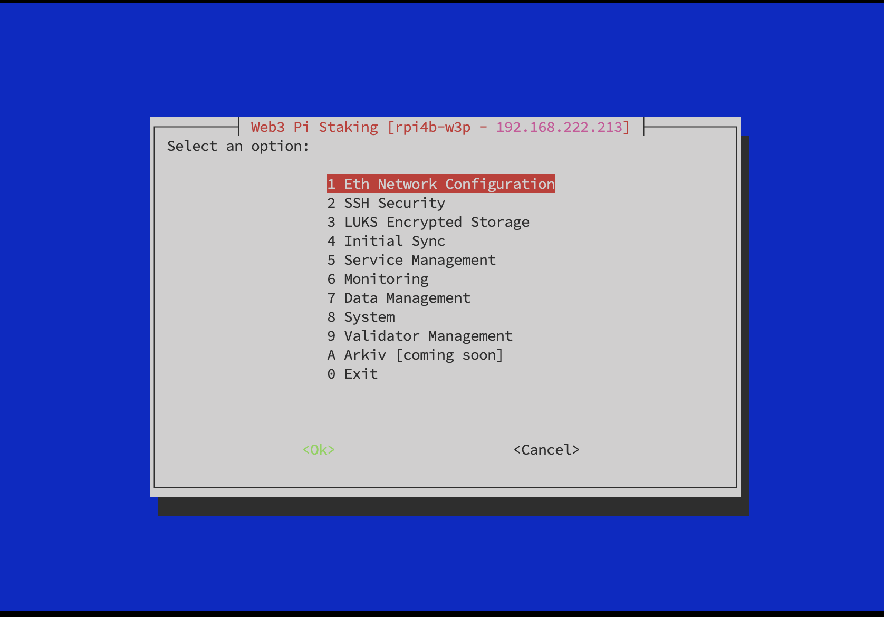
  </a>
</p>
<p align="center"><sub><i>The Control Panel — single TUI entry point for every operation</i></sub></p>

---

## Documentation Map

This README is the entry point. For deeper material, jump to:

| Document | What's in it |
|----------|--------------|
| **[desc.md](desc.md)** | **Full system reference** — architecture, users, LUKS internals, nftables rules, services, packages, every Control Panel option |
| [getting-started.md](getting-started.md) | Step-by-step staking walkthrough (network choice, keys import, daily ops) |

> If you want to understand **how the system is wired internally** (build phases,
> user model, encrypted partition layout, service dependencies, port table,
> firewall chains), read **[desc.md](desc.md)** — that is the canonical spec.

---

## Table of Contents

- [What This Image Provides](#what-this-image-provides)
- [Hardware Requirements](#hardware-requirements)
- [Building the Image](#building-the-image)
- [Flashing & First Boot](#flashing--first-boot)
- [The Control Panel](#the-control-panel)
- [Recommended Setup Order](#recommended-setup-order)
- [Importing Validator Keys](#importing-validator-keys)
- [Daily Operations (After Reboot)](#daily-operations-after-reboot)
- [File Locations](#file-locations)
- [Useful Commands](#useful-commands)
- [Network Ports](#network-ports)
- [Troubleshooting](#troubleshooting)
- [Optional Hardening](#optional-hardening)
- [Project Layout](#project-layout)
- [License](#license)

---

## What This Image Provides

A headless, security-hardened Ubuntu (`plucky` / 25.04) image targeting the Raspberry Pi 5,
pre-configured to run a **solo-staking validator**:

- **Execution Layer** — [Geth](https://geth.ethereum.org/) (Ethereum PPA)
- **Consensus Layer** — [Nimbus beacon node](https://nimbus.team/) (apt.status.im)
- **Validator Client** — Nimbus validator, isolated from the beacon node, keys on LUKS

Hardening highlights:

- nftables firewall, restrictive INPUT, IPv6 disabled
- Locked root, separated system users (`ethereum`, `el`, `cl`, `signer`)
- LUKS2 (AES-XTS, Argon2id) partition for validator keys, manually unlocked per boot
- SSH with rate-limited brute-force protection, optional FIDO2 hardware-key enforcement
- Systemd sandboxing on every service (`NoNewPrivileges`, `PrivateTmp`, `ProtectSystem=strict`)

Full details: **[desc.md](desc.md)**.

---

## Hardware Requirements

- Raspberry Pi 5 (**16 GB RAM** recommended — required for mainnet)
- NVMe SSD via PCIe HAT (**2 TB+** for mainnet; system boots from NVMe, no SD card)
- Active cooling (fan + heatsink; passive is not enough under sustained load)
- Official 5.1 V / 5 A power supply
- Wired Ethernet — Wi-Fi/LTE not recommended for staking
- Optional: Web3 Pi UPS for power-loss protection

---

## Building the Image

The image is produced by the [Armbian Build Framework](https://docs.armbian.com/Developer-Guide_Build-Options/),
configured via [userpatches/config-w3p.conf](userpatches/config-w3p.conf).

### Quick build (Docker — recommended)

```bash
git clone https://github.com/<org>/Web3-Pi-vOS.git
cd Web3-Pi-vOS

# Build inside a Docker container (clean, reproducible)
PREFER_DOCKER=yes ./compile.sh w3p
```

### Native build (Ubuntu/Debian host)

```bash
sudo ./compile.sh w3p
```

> Native builds require a Debian/Ubuntu host with build dependencies installed.
> See the [Armbian docs](https://docs.armbian.com/Developer-Guide_Build-Preparation/)
> for host requirements. **Docker is recommended** — it isolates the build and
> matches CI exactly.

### What `./compile.sh w3p` does

1. Loads [userpatches/config-w3p.conf](userpatches/config-w3p.conf) → `BOARD=rpi4b-w3p`, `RELEASE=plucky`, `BUILD_MINIMAL=yes`.
2. Builds the kernel, bootloader, and rootfs in a chroot.
3. Runs [userpatches/customize-image.sh](userpatches/customize-image.sh) inside the chroot — installs Geth/Nimbus, creates users, deploys the Control Panel and service files, locks down SSH/firewall.
4. Copies everything in [userpatches/overlay/](userpatches/overlay/) into the rootfs.
5. Packages an `.img` (and optionally `.img.xz`).

### Output

```
output/images/Armbian-unofficial_<ver>_Rpi4b-w3p_plucky_current_<kver>.img
```

Compressed image is ~400 MB; first boot on the Pi takes ~15 seconds.

> **Note on the board name**: `BOARD=rpi4b-w3p` targets the **Raspberry Pi 5** despite the name. This is a quirk of the Armbian `bcm2711` board family, which covers both Pi 4 and Pi 5.

---

## Flashing & First Boot

### 1. Flash to NVMe

Use [Balena Etcher](https://etcher.balena.io/) (or `dd`) to write the `.img` to an NVMe drive
connected to your workstation. There is no SD-card path — the Pi boots directly from NVMe.

### 2. First boot

1. Insert the NVMe into the Pi 5's PCIe slot.
2. Connect Ethernet.
3. Power on. First-boot setup completes in ~1–3 minutes.

### 3. Find the Pi and SSH in

```bash
# Try mDNS first
ssh ethereum@rpi4b-w3p.local

# Or use the IP from your router's DHCP table
ssh ethereum@<IP_ADDRESS>
```

Default credentials:

- **Username:** `ethereum`
- **Password:** `ethereum`

You will be **forced to change the password** on first login.

<p align="center">
  <a href="docs/images/01-first-login-password-change.png">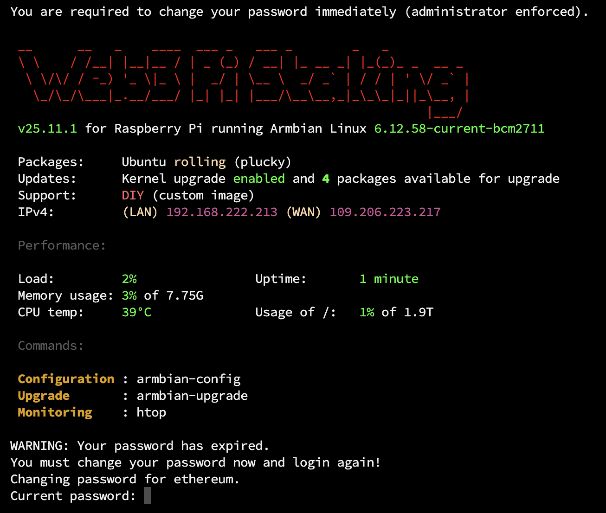</a>
</p>
<p align="center"><sub><i>Left: forced password change on first login. Right: MOTD banner with system stats — launch the Control Panel from here.</i></sub></p>

---

## The Control Panel

**All system configuration goes through the Control Panel** — a whiptail-based TUI
that wraps every operation you'd otherwise do by editing config files and running systemd commands.

### Launch it

```bash
sudo /opt/web3pi/control-panel.sh
```

A symlink exists in the home directory, so this also works:

```bash
sudo ./control-panel.sh
```

### Top-level menu

| # | Section | What it does |
|---|---------|--------------|
| 1 | **Eth Network Configuration** | Network (`hoodi` / `holesky` / `mainnet`), Geth/Nimbus P2P ports, fee recipient |
| 2 | **SSH Security** | Add/remove keys, toggle password auth, require FIDO2 hardware keys |
| 3 | **LUKS Encrypted Storage** | Create/unlock encrypted partition for validator keys, change passphrase |
| 4 | **Initial Sync** | Trusted-node (checkpoint) sync from a curated server list |
| 5 | **Service Management** | Start/stop/enable Geth, Nimbus beacon, Nimbus validator; view logs |
| 6 | **Monitoring** | Live sync status, peers, RAM/CPU/temps, disk usage (auto-refresh) |
| 7 | **Data Management** | Wipe Geth / Nimbus / signer / all data (with double-confirmation) |
| 8 | **System** | Hostname, timezone, keyboard, EEPROM update, OC stress test, reboot/shutdown |
| 9 | **Validator Management** | Import keys (SSH or USB), fee recipient, graffiti, start/stop, voluntary exit |

> A complete annotated tree of every submenu is in [desc.md §8](desc.md).

### Submenu gallery

Every Control Panel section is a self-contained whiptail menu. Click any thumbnail for full size.

<table>
<tr>
<td align="center" width="33%">
<a href="docs/images/04-network-configuration.png">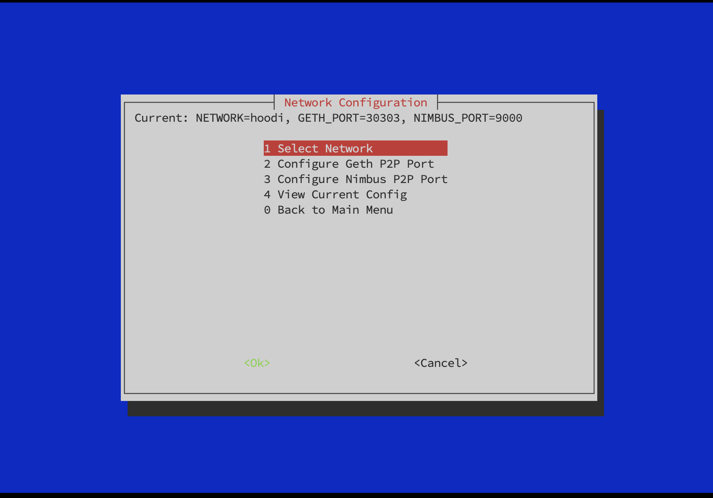</a><br>
<b>Eth Network Configuration</b><br>
<sub>Network · Geth/Nimbus P2P ports</sub>
</td>
<td align="center" width="33%">
<a href="docs/images/05-ssh-security.png">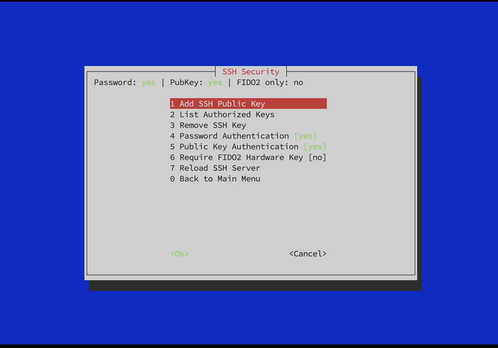</a><br>
<b>SSH Security</b><br>
<sub>Keys · password auth · FIDO2</sub>
</td>
<td align="center" width="33%">
<a href="docs/images/06-luks-encrypted-storage.png">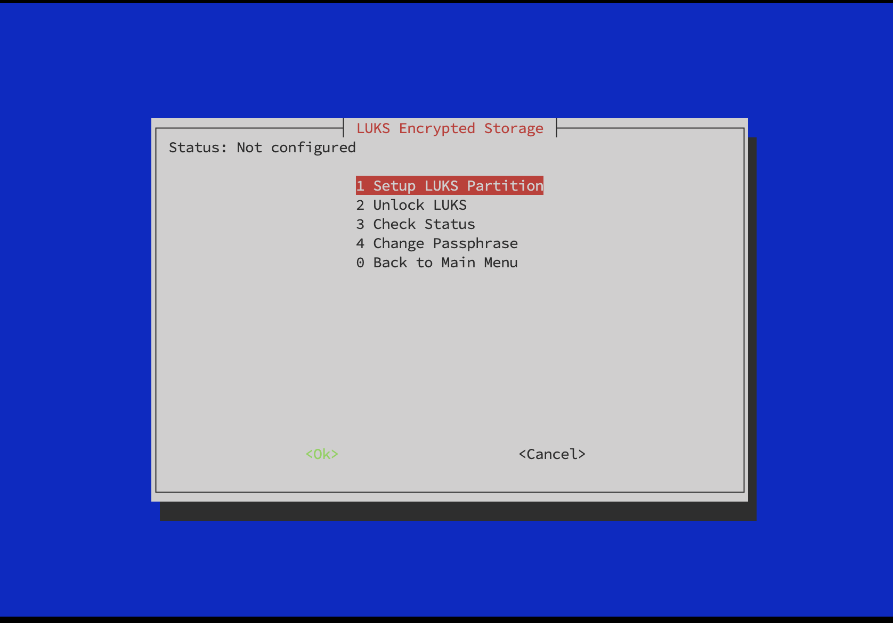</a><br>
<b>LUKS Encrypted Storage</b><br>
<sub>Encrypted partition for validator keys</sub>
</td>
</tr>
<tr>
<td align="center">
<a href="docs/images/07-initial-sync.png">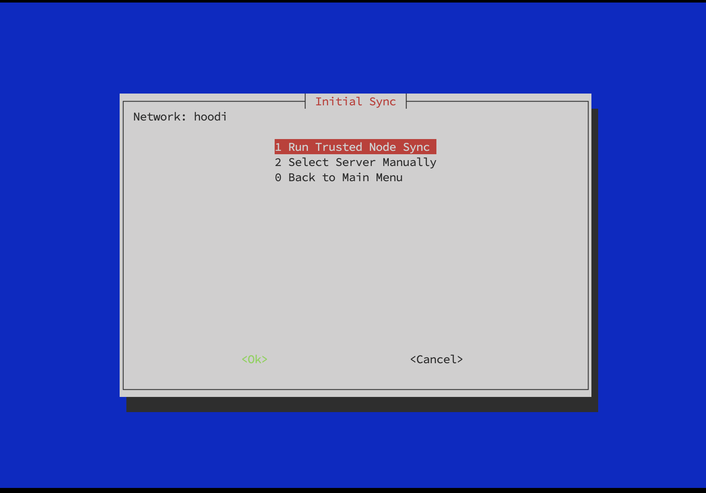</a><br>
<b>Initial Sync</b><br>
<sub>Trusted-node checkpoint sync</sub>
</td>
<td align="center">
<a href="docs/images/08-service-management.png">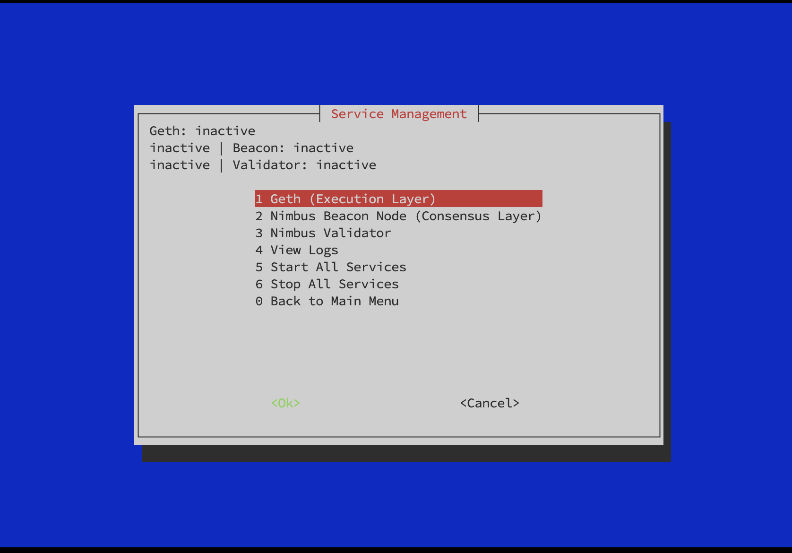</a><br>
<b>Service Management</b><br>
<sub>Geth · Nimbus beacon · validator</sub>
</td>
<td align="center">
<a href="docs/images/09-monitoring.png">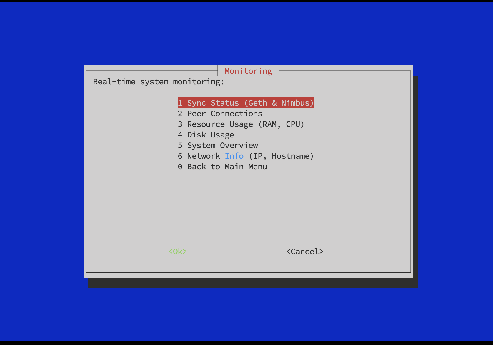</a><br>
<b>Monitoring</b><br>
<sub>Sync · peers · RAM/CPU · disk</sub>
</td>
</tr>
<tr>
<td align="center">
<a href="docs/images/10-data-management.png">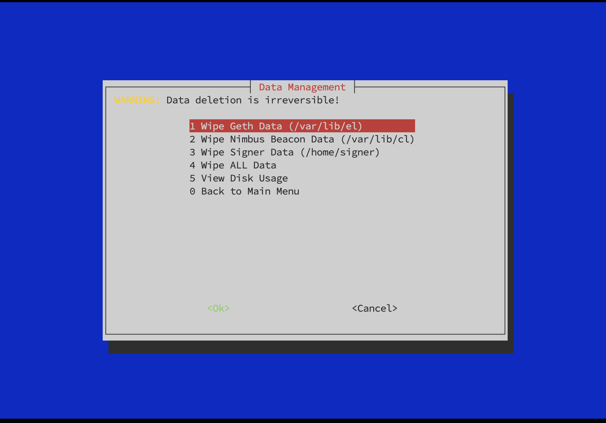</a><br>
<b>Data Management</b><br>
<sub>Wipe Geth / Nimbus / signer data</sub>
</td>
<td align="center">
<a href="docs/images/11-system-menu.png">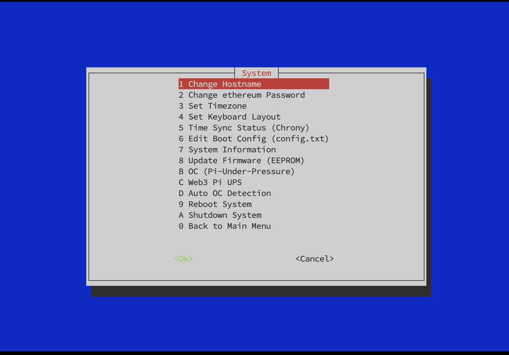</a><br>
<b>System</b><br>
<sub>Hostname · timezone · EEPROM · OC</sub>
</td>
<td align="center">
<a href="docs/images/16-validator-management.png">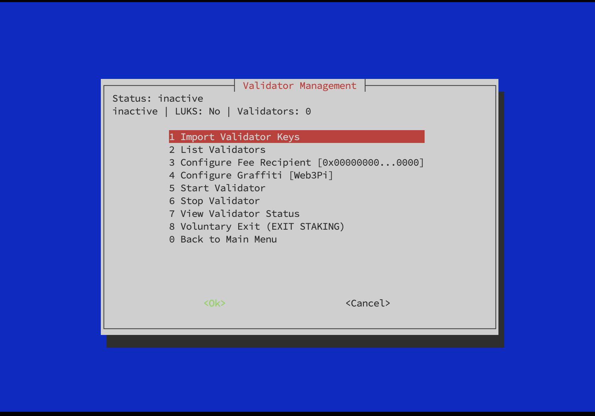</a><br>
<b>Validator Management</b><br>
<sub>Import keys · fee recipient · exit</sub>
</td>
</tr>
</table>

#### System submenu — power & overclocking tools

<table>
<tr>
<td align="center" width="25%">
<a href="docs/images/12-system-menu-ups-highlighted.png">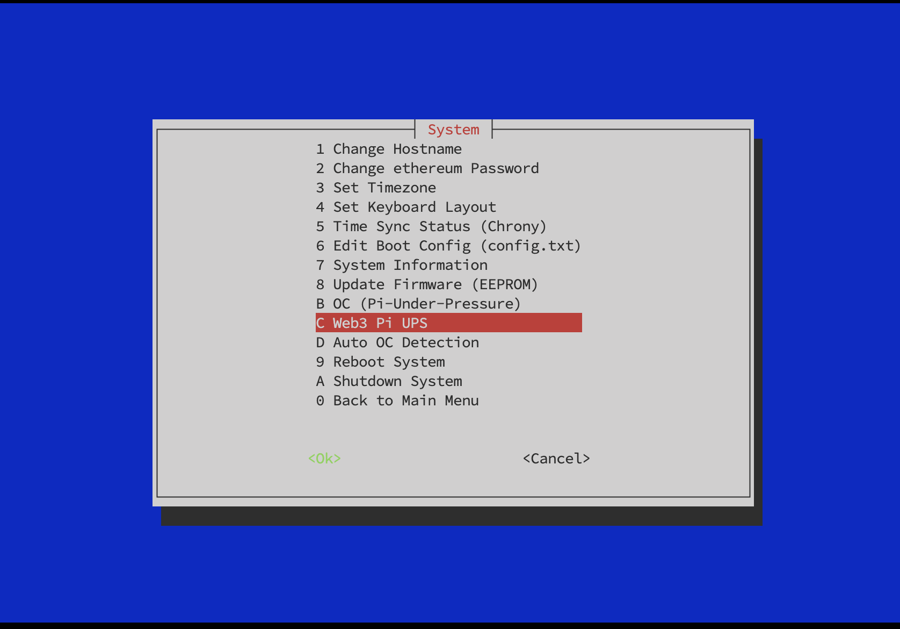</a><br>
<sub>Navigating to <b>Web3 Pi UPS</b></sub>
</td>
<td align="center" width="25%">
<a href="docs/images/13-web3-pi-ups.png">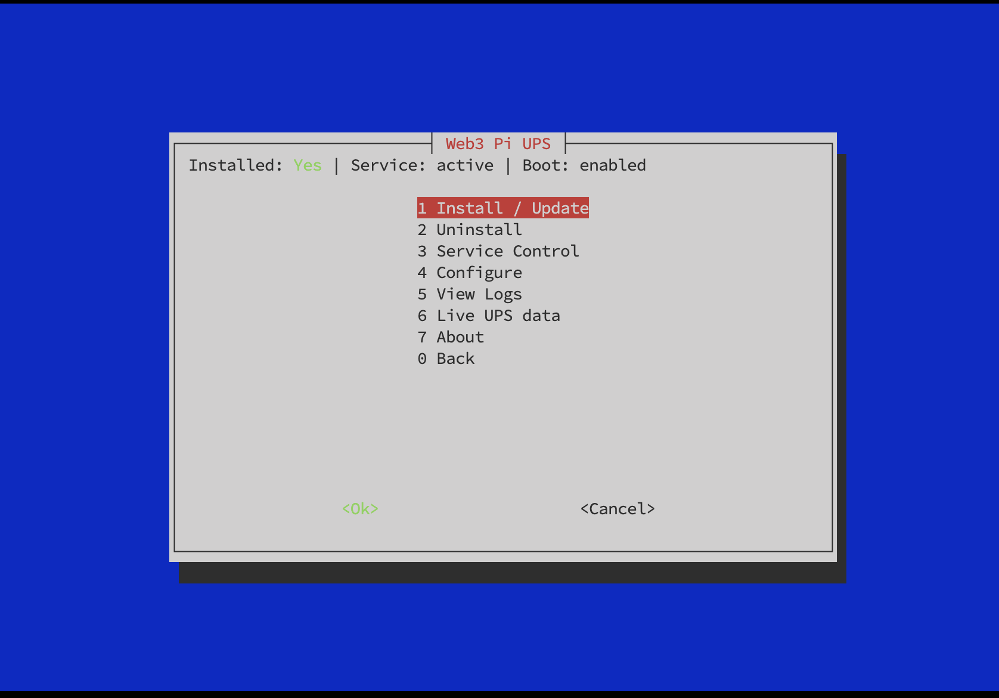</a><br>
<b>Web3 Pi UPS</b><br>
<sub>Install · service · live data</sub>
</td>
<td align="center" width="25%">
<a href="docs/images/14-pi-under-pressure.png">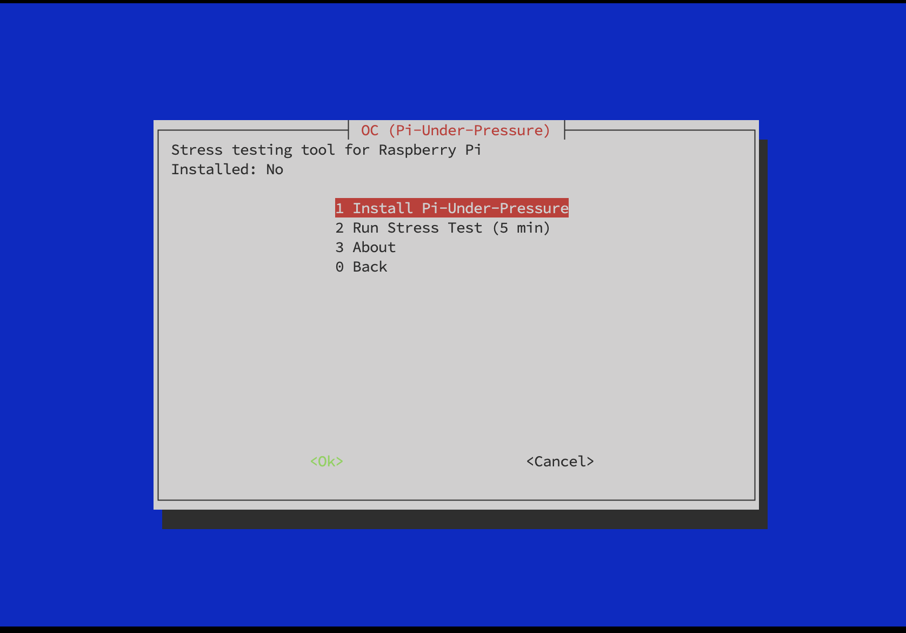</a><br>
<b>Pi-Under-Pressure</b><br>
<sub>5-minute thermal stress test</sub>
</td>
<td align="center" width="25%">
<a href="docs/images/15-auto-oc-detection.png">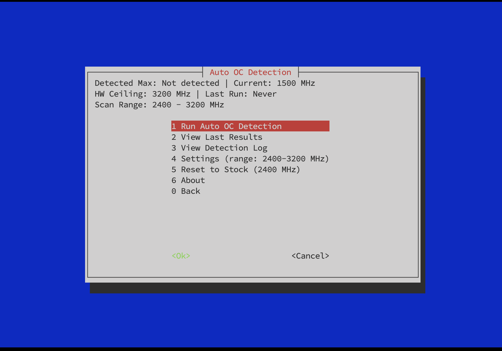</a><br>
<b>Auto OC Detection</b><br>
<sub>Find max stable clock automatically</sub>
</td>
</tr>
</table>

<p align="center">
  <a href="docs/images/17-web3-pi-ups-live-data.png">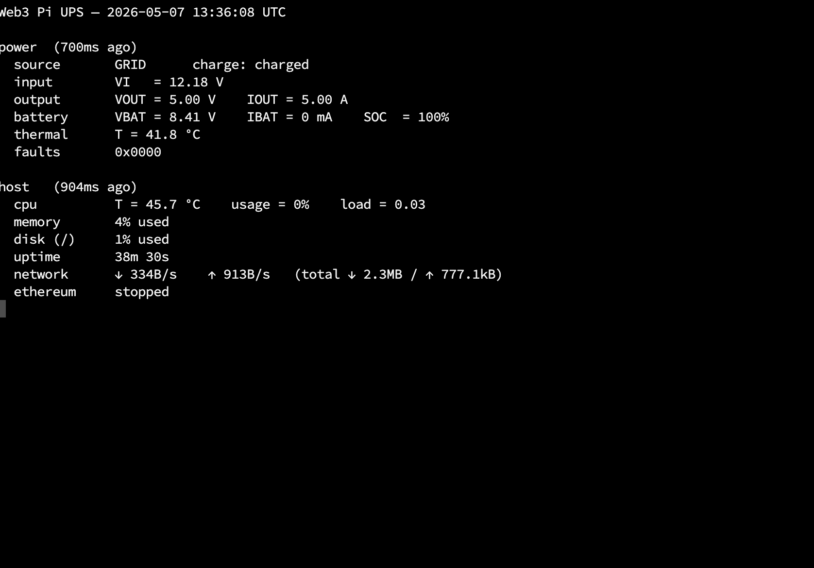</a>
</p>
<p align="center"><sub><i><b>Web3 Pi UPS → Live UPS data</b> — real-time power telemetry (source, V/I, battery SoC, thermal, faults) alongside host stats (CPU, memory, disk, network, Ethereum status). Project: <a href="https://github.com/Web3-Pi/Web3-Pi-UPS">Web3-Pi/Web3-Pi-UPS</a>.</i></sub></p>

---

## Recommended Setup Order

Once you're SSH'd in and have launched the Control Panel:

1. **SSH Security** → add your public key, then disable password auth.
2. **Eth Network Configuration** → pick a network (start with `hoodi`).
3. **LUKS Encrypted Storage** → create the encrypted partition (set a strong passphrase).
4. **Initial Sync** → run trusted-node sync (skips weeks of genesis sync).
5. **Service Management** → enable + start Geth and Nimbus beacon.
6. **Monitoring** → wait for both EL and CL to fully sync.
7. **Validator Management** → import keys, set fee recipient, start the validator.

---

## Importing Validator Keys

After EL + CL are fully synced and LUKS is unlocked:

### Option A — Over SSH (recommended)

```bash
# From your workstation
scp keystore-*.json ethereum@<PI_IP>:~/validator_keys/
```

Then in the Pi's Control Panel:

**Validator Management** → **Import Validator Keys** → **From `~/validator_keys`**

You'll be prompted for the keystore password. After import, keystore files are moved
to the encrypted LUKS partition (needed for Voluntary Exit).

### Option B — Via USB drive

1. Copy keystores to a USB stick.
2. Plug it into the Pi.
3. **Validator Management** → **Import Validator Keys** → **From USB drive**.

> **Always keep an offline backup of your keystores.** They're required for Voluntary Exit.

---

## Daily Operations (After Reboot)

LUKS does not auto-unlock — that's by design. After every reboot:

```bash
sudo /opt/web3pi/control-panel.sh
# → LUKS Encrypted Storage → Unlock LUKS
# → Validator Management → Start Validator
```

Or directly:

```bash
sudo /opt/web3pi/unlock-luks.sh
sudo /opt/web3pi/start-validator.sh
```

Geth and Nimbus beacon node start automatically on boot if you enabled them.

---

## File Locations

| Component | Path |
|-----------|------|
| Control Panel | `/opt/web3pi/control-panel.sh` |
| Central config | `/opt/web3pi/config` |
| Helper scripts | `/opt/web3pi/` (`setup-luks.sh`, `unlock-luks.sh`, `start-validator.sh`, …) |
| Logs | `/opt/web3pi/logs/` |
| Geth data | `/var/lib/el` |
| Nimbus beacon data | `/var/lib/cl` |
| Validator keys | `/home/signer/keys` (LUKS-encrypted) |
| Key import staging | `/home/ethereum/validator_keys` |

Full layout: [desc.md §2.2](desc.md).

---

## Useful Commands

```bash
# Control Panel — your main entry point
sudo /opt/web3pi/control-panel.sh

# Service control
sudo systemctl status geth
sudo systemctl status nimbus-beacon-node
sudo systemctl status nimbus-validator

# Logs
sudo journalctl -u geth -f
sudo journalctl -u nimbus-beacon-node -f

# Sync checks
geth attach --datadir /var/lib/el --exec "eth.syncing"
curl -s http://127.0.0.1:5052/eth/v1/node/syncing | jq

# Firewall + disk
sudo nft list ruleset
df -h
```

---

## Network Ports

| Port | Proto | Service | Exposure |
|------|-------|---------|----------|
| 22 | TCP | SSH | Public, rate-limited (5/min) |
| 30303 | TCP/UDP | Geth P2P | Public — forward on router |
| 9000 | TCP/UDP | Nimbus P2P | Public — forward on router |
| 8545 | TCP | Geth HTTP-RPC | Localhost only |
| 8551 | TCP | Engine API (JWT) | Localhost only |
| 5052 | TCP | Nimbus REST API | Localhost only |

> **Forward 30303 and 9000** on your router to maximize peer count and improve sync speed.

---

## Troubleshooting

**Services won't start** → Control Panel → **Monitoring** → view logs, or:

```bash
sudo journalctl -u geth -n 100
sudo journalctl -u nimbus-beacon-node -n 100
```

**Validator won't start** → Verify LUKS is unlocked (Control Panel → **LUKS Encrypted Storage** → **Check Status**) and that fee recipient is configured.

**Sync stuck** → Check peers in **Monitoring**; verify port forwarding for 30303/9000.

**Can't find the Pi** → Try `ping rpi4b-w3p.local` (mDNS), or check your router DHCP table.

More cases in [getting-started.md](getting-started.md#troubleshooting).

---

## Optional Hardening

The default firewall allows DNS to any resolver (DHCP compatibility). To restrict outbound DNS:

1. Edit `/etc/nftables.conf`, replace the open DNS rules with:
   ```nft
   udp dport 53 ip daddr { 1.1.1.1, 8.8.8.8, 9.9.9.9 } accept
   tcp dport 53 ip daddr { 1.1.1.1, 8.8.8.8, 9.9.9.9 } accept
   ```

2. Pin DNS resolvers in `/etc/systemd/network/10-eth.network`:
   ```ini
   [Match]
   Name=eth* end*

   [Network]
   DHCP=yes
   DNS=1.1.1.1
   DNS=8.8.8.8
   DNS=9.9.9.9

   [DHCP]
   UseDNS=false
   ```

3. Apply:
   ```bash
   sudo systemctl restart systemd-networkd
   sudo systemctl restart nftables
   ```

This blocks DNS hijacking from rogue DHCP and ensures consistent resolution.

---

## Project Layout

```
Web3-Pi-vOS/
├── compile.sh                       # Armbian build entry point
├── userpatches/
│   ├── config-w3p.conf              # Build configuration (BOARD, RELEASE, options)
│   ├── customize-image.sh           # Chroot customization (build-time)
│   └── overlay/
│       ├── rc.local                 # First-boot setup (runtime)
│       └── opt/web3pi/              # Control Panel, scripts, service files
├── config/boards/rpi4b-w3p.conf     # Custom board definition
├── desc.md                          # ⭐ Full system reference
├── getting-started.md               # Step-by-step staking guide
└── README.md                        # You are here
```

The two-phase setup (chroot build-time vs. on-device first-boot) is described in
[desc.md §2.1](desc.md) and [CLAUDE.md](CLAUDE.md).

---

## License

See [LICENSE](LICENSE). Inherits the Armbian build framework license; project-specific
additions follow the same terms.

---

*For the full system reference — architecture diagrams, user model, every Control Panel
submenu, packages, services, and security details — see **[desc.md](desc.md)**.*
